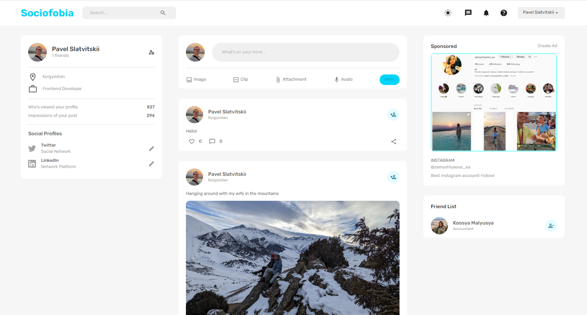

# SOCIAL MEDIA MVP

MVP social media service with basic functionality: authentication, create post, news feed, likes. This is a pet-project for mastering skills. You can use mock login: pavel@pavel.ru and password: 123456. Backend is using free MongoDB cloud-service, so data pending may take few minutes to load.

## Technologies Used

**Frontend**

- React
- Redux
- Material UI

**Backend**

- Express
- MongoDB
- NodeJS

## Contributing

Contributions to this project are welcome! If you have any suggestions or find any issues, please feel free to submit a pull request.
